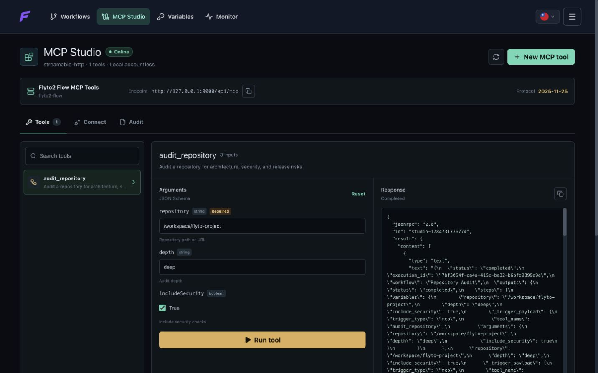

<p align="center">
  
</p>

# Flyto2 Flow

> Turn a visual workflow into a local MCP tool. No custom server, no account,
> and no hidden cloud runtime.

[](https://github.com/flytohub/flyto-flow/actions/workflows/ci.yml)
[](https://hub.docker.com/r/flyto2/flow)
[](LICENSE)

Building an automation is only half the job. An AI agent still needs a tool
schema, an MCP transport, access controls, execution history, and enough
evidence to explain what happened. Maintaining that glue beside every workflow
is slow and easy to get wrong.

Flyto2 Flow is a source-available, self-hosted visual workflow builder that
closes that gap. Combine browser automation, HTTP APIs, files, data processing,
AI steps, and control flow; run the workflow through `flyto-core`; then expose
the same workflow as a typed MCP tool from the built-in MCP Studio.

```text
Design visually -> test locally -> expose as MCP -> call from an agent -> audit the run
```

## See It Work

https://github.com/user-attachments/assets/4357d9a7-0c20-4252-8f72-695da275a3ec

### Build and Debug Visually


Compose browser automation, APIs, files, data transformations, AI operations,
and control flow on one canvas. Run locally, inspect each step, and retain
evidence for the result.

### Publish the Workflow as an MCP Tool



MCP Studio generates the tool contract from the workflow, provides a local test
surface, and produces connection settings for Codex, Claude Code, desktop
clients, and Streamable HTTP clients.

## Quick Start

Requirement: Docker Engine or Docker Desktop.

```bash
docker pull docker.io/flyto2/flow:0.1.1
docker run --detach \
  --name flyto-flow \
  --init \
  --restart unless-stopped \
  --shm-size=1g \
  --publish 127.0.0.1:9000:9000 \
  --volume flyto-flow-data:/data/flyto \
  docker.io/flyto2/flow:0.1.1
```

Open <http://127.0.0.1:9000>. Data is stored in the
`flyto-flow-data` Docker volume. Production deployments should pin the digest
reported by the release workflow.

To review and build the image from source, follow
[Build from Source](docs/getting-started.md#build-from-source).

## Usage

### Create Your First Agent Tool

1. Open **MCP Studio** from the primary navigation.
2. Select **New tool** to create an MCP-triggered starter workflow.
3. Edit the workflow, add the steps that do the work, and define its inputs.
4. Return to **MCP Studio**, run the generated schema form, and inspect the
   response.
5. Open **Connect** and use the generated Codex, Claude Code, desktop-client,
   or Streamable HTTP configuration.

The complete install, verification, backup, and exposure guidance is in
[Getting Started](docs/getting-started.md).

## First-Run Starters

An empty local workspace receives three editable templates:

| Starter | Typed input | Result |
| --- | --- | --- |
| HTTP GET Request Tool | `url` | HTTP response |
| Browser Screenshot Tool | `url` | PNG screenshot |
| JSON to CSV Tool | `records` | CSV artifact |

They are small enough to inspect before the first run and complete enough to
call from MCP Studio. Existing template libraries are never changed or
backfilled during startup. See
[First-Run Starter Templates](docs/starter-templates.md) for step contracts,
defaults, safety boundaries, and the path from template to agent tool.

## Why Flyto2 Flow

| Pain | What Flow provides |
| --- | --- |
| A workflow and its agent interface drift apart | The MCP tool schema is generated from the workflow trigger and input fields |
| A visual demo works, but production failures are opaque | Local run history, evidence, replay, lineage, metrics, traces, and alerts |
| Browser and API steps require separate automation stacks | One canvas for browser, HTTP, file, data, AI, and control-flow steps |
| Self-hosting still calls a vendor service | Accountless startup, loopback binding, local SQLite storage, and no application telemetry |
| Agent tools are exposed without context | Source workflow, contract version, deterministic fingerprint, risk, approval, and evidence metadata |

Flyto2 Flow is designed for developers and operators who want a visual
automation builder without giving up local execution or MCP-level inspection.
It is not a hosted team workspace, billing platform, marketplace, or managed
runner. Those boundaries are deliberate and tested.

## What You Can Build

- **Browser research tools:** navigate, interact, extract structured results,
  and retain evidence for review.
- **API operations:** call authenticated HTTP services, transform data, branch,
  retry, and return a typed result to an agent.
- **Human-approved actions:** pause at a breakpoint before a sensitive step and
  continue only after operator approval.
- **Local document pipelines:** read and write files, process data, and keep the
  runtime on the operator-controlled machine.
- **Reusable agent capabilities:** turn a tested workflow into a discoverable
  MCP tool instead of maintaining a second server by hand.

See [Use Cases](docs/use-cases.md) for concrete workflow shapes and safety
considerations.

## MCP Studio

MCP Studio is the control surface for workflow-backed tools:

- discover workflows whose `flow.trigger` uses `trigger_type: mcp`;
- inspect and fill the generated JSON Schema;
- make a live local tool call and review the response;
- copy client configuration for Codex, Claude Code, desktop clients, or any
  Streamable HTTP client;
- audit the tool's source, contract, fingerprint, risk, approval policy, and
  evidence references.

The default endpoint is accountless and loopback-only. Non-loopback MCP access
is rejected unless the operator explicitly configures a bearer token. Read
[MCP Studio and Client Setup](docs/mcp-studio.md) before exposing it beyond the
local machine.

## API

The local FastAPI gateway provides health, runtime configuration, workflow,
template, execution, capability, and MCP surfaces under `/api`. The
Streamable HTTP MCP endpoint is loopback-only by default and is not a hosted
account API.

Use [MCP Studio and Client Setup](docs/mcp-studio.md) for client contracts and
[Architecture](ARCHITECTURE.md) for route ownership and trust boundaries.
Treat backend models and the running OpenAPI document as the source of truth
for exact request and response fields.

## Configuration

Start from `install/.env.ce.example`; do not commit `install/.env.ce`.
Loopback binding, MCP bearer-token behavior, allowed browser origins, storage
paths, and offline Core activation are operator-controlled settings. The
[Deployment File Guide](install/README.md) explains file ownership, persistent
data, and image verification. Network exposure guidance is in
[Getting Started](docs/getting-started.md#network-exposure).

## Architecture

```text
Vue visual builder
        |
FastAPI local gateway ---- SQLite workspace, runs, evidence, replay
        |
flyto-core execution engine ---- Playwright + Chromium
        |
MCP stdio bridge / Streamable HTTP endpoint
```

The release image bundles `flyto-core`, Playwright, and Chromium. Starting a
built image does not download runtime dependencies. Operator-supplied
`flyto-core` wheels are accepted only through a size-limited, path-checked,
SHA-256-verified offline importer.

Read [Architecture](ARCHITECTURE.md) for component ownership, data flow,
security boundaries, and extension points.

## Local Means Local

Flyto2 Flow starts without an account, email address, or password. It contains
no Firebase integration, hosted membership system, chat, marketplace, remote
collaboration, billing, analytics, telemetry, CDN loader, or automatic package
download.

The application makes no implicit outbound connection. A workflow can access a
URL when its operator deliberately adds and runs a network-capable step; that
is workflow behavior, not application phone-home traffic.

The default Compose configuration publishes only to `127.0.0.1`. Keep it on
loopback unless it is deliberately placed behind an authenticated reverse
proxy. See [Security Policy](SECURITY.md) and
[CE/Cloud Boundary](docs/ce-cloud-boundary.md).

## Development

Requirements: Python 3.12 and Node.js 20. Docker is the supported way to obtain
the exact browser runtime.

```bash
python -m venv .venv
. .venv/bin/activate
pip install --require-hashes -r src/ui/web/backend/requirements-ce.lock
npm --prefix src/ui/web/frontend ci
npm --prefix src/ui/web/frontend run build
python src/ui/web/backend/main_offline.py --host 127.0.0.1 --port 9000 --no-reload
```

## Testing

Run the same repository gates used by CI:

```bash
make verify
flyto-index scan .
flyto-index verify . --strict
```

## Project Guide

| Document | Purpose |
| --- | --- |
| [Project](PROJECT.md) | Product promise, audience, scope, and success criteria |
| [Architecture](ARCHITECTURE.md) | Runtime components, trust boundaries, and data flow |
| [Current State](STATE.md) | Shipped, validated, limited, and pending work |
| [Roadmap](ROADMAP.md) | Outcome-led priorities without release-date promises |
| [Tasks](tasks.md) | Maintainer-ready work queue and definition of done |
| [Decisions](DECISIONS.md) | Durable architecture and product decisions |
| [Getting Started](docs/getting-started.md) | Install, first tool, backup, update, and verification |
| [Starter Templates](docs/starter-templates.md) | First-run HTTP, browser screenshot, and JSON-to-CSV MCP examples |
| [MCP Studio](docs/mcp-studio.md) | Tool contract, client setup, access, and audit metadata |
| [Use Cases](docs/use-cases.md) | Practical workflow patterns and guardrails |
| [Documentation Index](docs/README.md) | Maintained operator, product, boundary, and release documentation |
| [Feature Reference](docs/FEATURES.md) | Product surfaces mapped to source, limits, tests, and verification |
| [Python API Reference](docs/reference/python-api.md) | Generated classes, functions, methods, signatures, and source links |
| [Frontend Source Inventory](docs/reference/frontend-inventory.md) | Generated Vue, JavaScript, and TypeScript modules and callables |
| [API Route Reference](docs/reference/api-routes.md) | Generated FastAPI methods, paths, handlers, and source links |
| [Environment Reference](docs/reference/environment.md) | Generated runtime configuration names and handling guidance |
| [Deployment Files](install/README.md) | Compose, image, environment, persistence, and release verification |
| [Source Map](src/README.md) | Runtime ownership and source entry points |
| [Script Guide](scripts/README.md) | Repository verification and release scripts |
| [Test Guide](tests/README.md) | Test layers and commands |
| [Edition Matrix](docs/edition-matrix.md) | Source-available baseline versus hosted product boundary |
| [Contributing](CONTRIBUTING.md) | Change process, checks, license, and contribution terms |

## Contributing

Start with a focused issue that explains the user problem and smallest useful
outcome. Bug reports should include the revision, deployment mode, reproduction
steps, and sanitized evidence. Feature proposals must explain why the change
belongs in the self-hosted baseline rather than the hosted product.

Read [Contributing](CONTRIBUTING.md), the
[Contributor License Agreement](CONTRIBUTOR_LICENSE_AGREEMENT.md), and the
[Flow/Cloud Sync Contract](docs/flow-cloud-sync.md) before opening a pull
request. Security reports must follow [Security Policy](SECURITY.md), never a
public issue.

## License and Trademark

Current revisions use the [PolyForm Shield License 1.0.0](LICENSE): you may
inspect, use, modify, and distribute the code for permitted purposes, but you
may not use it to provide a product or service that competes with Flyto2. This
is source-available/fair-code, not OSI-approved open source. Revisions through
commit `9398a62` remain Apache-2.0 and cannot be retroactively restricted.

Read [License History](LICENSE_HISTORY.md),
[Commercial Licensing](COMMERCIAL_LICENSE.md), [Trademark Policy](TRADEMARKS.md),
and [Licensing Strategy](docs/licensing-strategy.md) before redistribution or
commercial use.
