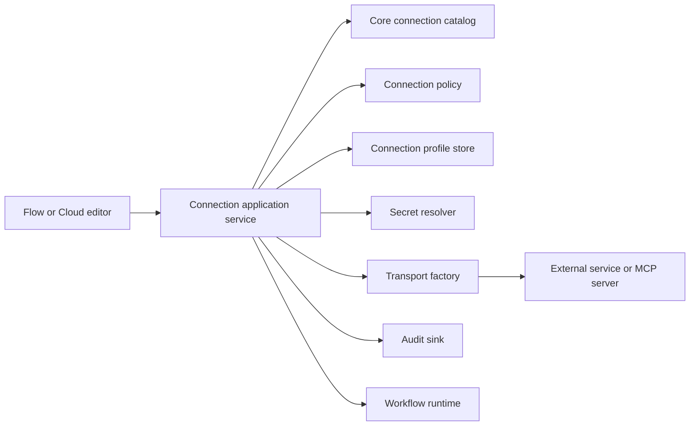

# External Connection Injection Contract

Status: implemented baseline contract

Owners: Flyto2 Core, Flyto2 Flow, and Flyto2 Cloud maintainers

Contract version: 1

## Purpose

This contract defines how the Flyto2 product family discovers, stores,
authorizes, resolves, tests, and uses external connections without coupling a
workflow to Firebase, a hosted secret manager, a desktop keychain, or a
specific execution topology.

The same workflow and connection type must be portable across local, offline,
Cloud, self-hosted Enterprise, and air-gapped deployments. Each deployment may
provide different persistence, secret, policy, audit, and transport adapters.
Those adapters must implement the same ports and must not change workflow
semantics.

This document uses "connection" for an external system profile such as GitHub,
PostgreSQL, Slack, an HTTP API, or an MCP server. A connection is not a visual
edge between workflow nodes.

## Current Foundation

The target contract builds on behavior that already exists:

- Flyto2 Cloud selects auth, access, audit, and data providers through
  `ProviderHub` and `DeploymentMode`.
- `RegistryLoader` loads module registries and connection validation from the
  installed `flyto-core` package.
- `SecretRef` keeps credential values out of workflow parameters and resolves
  them at execution time.
- `/runtime-config` describes the active edition, deployment mode, providers,
  network policy, and unsupported surfaces to the frontend.

The dedicated external-connection ports are implemented in
`services.connections`. Flow provides local profile, policy, secret, and audit
adapters. Concrete transport and tenant-aware adapters remain owned by Core,
Cloud, or an allowlisted Enterprise provider package. New connection features
must follow this contract instead of adding deployment-specific branches to
API routes or workflow code.

## Architectural Boundary



The application service is the only orchestration layer allowed to combine
profile metadata, authorization, secrets, and transports. UI components,
workflow YAML, API route handlers, and module implementations must not read a
deployment-specific secret store or hosted database directly.

## Required Ports

The names below describe responsibilities. Language-specific interfaces may
use local naming conventions, but a one-to-one mapping to these ports must be
documented.

### ConnectionCatalog

`ConnectionCatalog` provides immutable connection type definitions from
Flyto2 Core:

- stable type identifier
- definition and schema version
- non-secret configuration schema
- required secret slots
- supported authentication methods
- supported transport kinds
- test and health-check capability
- module and action compatibility
- migration and deprecation metadata

Catalog definitions must be deterministic and must not depend on a tenant,
deployment mode, or secret backend.

### ConnectionProfileStore

`ConnectionProfileStore` persists connection profile metadata:

- profile identifier and display name
- connection type and schema version
- organization, project, workflow, or local scope
- non-secret configuration
- secret references
- policy metadata
- creation, update, and disabled state

The store must never persist plaintext credentials. Listing a profile must be
safe without decrypting or resolving any secret.

### ConnectionPolicy

`ConnectionPolicy` authorizes every operation before secret resolution:

- create, read, update, delete, test, and use
- actor and tenant membership
- profile scope
- workflow and execution identity
- requested hosts, ports, protocols, and transport kind
- deployment network and air-gap policy

Unknown connection types, missing policy context, and unsupported transports
must fail closed.

### SecretResolver

`SecretResolver` converts a validated secret reference into a short-lived
in-memory value for an authorized execution. It must:

- resolve only after `ConnectionPolicy` succeeds
- bind resolution to actor, tenant, profile, workflow, and execution context
- return the minimum fields required by the selected connection definition
- support rotation and key versioning
- redact values from logs, traces, events, errors, and API responses
- avoid caching plaintext beyond the operation lifetime

Secret values must not be placed in workflow YAML, profile metadata, browser
storage, synchronization payloads, or generated evidence.

### TransportFactory

`TransportFactory` creates a bounded client or session from a validated
definition, profile, policy decision, and resolved secret set. It owns:

- endpoint normalization
- DNS and address validation
- TLS requirements
- proxy and egress policy
- connection and request timeouts
- retry and rate-limit behavior
- maximum response and stream sizes
- lifecycle cleanup

A transport adapter must not decide tenant authorization or retrieve secrets
on its own.

### ConnectionAuditSink

`ConnectionAuditSink` records security-relevant metadata without secret values:

- actor, tenant, profile, workflow, and execution identifiers
- operation and policy result
- connection type and transport kind
- normalized destination classification
- start time, duration, result class, and correlation identifier

Offline deployments may use a local append-only sink. A no-op sink is allowed
only for development and must be advertised by runtime capabilities.

## Composition Root

Each executable process must assemble one immutable connection runtime at
startup:

```python
ConnectionRuntime(
    catalog=...,
    profiles=...,
    policy=...,
    secrets=...,
    transports=...,
    audit=...,
)
```

Request handlers and workflow runners receive this runtime through explicit
dependency injection. They must not select an adapter from environment
variables at the call site. Environment parsing belongs to the composition
root, next to `DeploymentMode` and existing provider assembly.

Workers must receive the same effective policy and profile revision as the
control plane. A queued execution must bind the profile identifier and
revision, never a resolved secret.

## Repository Ownership

### Flyto2 Core

Flyto2 Core owns portable semantics:

- connection type identifiers and schemas
- catalog and validation behavior
- module-to-connection compatibility
- schema migrations and deprecation metadata
- neutral request and response models
- execution-facing connection handles
- conformance fixtures for all implementations

Core must not import Firebase, a Cloud database SDK, a desktop keychain, or an
Enterprise-only client.

### Flyto2 Flow

Flyto2 Flow owns the accountless and local implementation:

- local profile persistence
- local encrypted secret storage or operating-system keychain integration
- offline policy defaults and explicit network controls
- in-process and local worker composition
- connection editor, test status, and local recovery UI
- local audit evidence

Flow must remain usable without a Flyto2 account and without a connection to
Flyto2 Cloud. It must not contain hosted tenant, billing, Firebase,
collaboration, or managed-runner behavior.

### Flyto2 Cloud

Flyto2 Cloud owns hosted and commercial implementations:

- tenant-aware profile persistence
- managed secret backends
- organization and role-based authorization
- hosted audit, retention, and compliance controls
- remote worker dispatch and policy propagation
- Enterprise and air-gap adapter composition
- hosted connection lifecycle APIs and operational telemetry

Cloud consumes Core contracts and may reuse Flow's edition-neutral UI through
the guarded shared-file allowlist. Hosted adapters and tenant-aware code are
never synchronized into Flow.

## Deployment Matrix

| Deployment | Profile store | Secret resolver | Transport | Audit |
| --- | --- | --- | --- | --- |
| Flow local | Local database | OS keychain or encrypted local store | In-process or local worker | Local evidence |
| Flow offline | Local database | Encrypted local store | Explicitly allowlisted local or private targets | Local append-only evidence |
| Cloud hosted | Tenant-aware managed store | Managed secret service | Managed worker | Central audit service |
| Enterprise self-hosted | PostgreSQL-compatible store | Vault-compatible or operator-selected backend | Private worker pool | Enterprise audit store |
| Enterprise air-gap | Private local store | Private secret backend | No public egress; private targets only | Private append-only or SIEM sink |

Firebase may implement a Cloud adapter, but it is not part of the contract and
must not appear in Core or Flow interfaces. Replacing Firebase must require a
composition change, not a workflow or UI schema migration.

## Canonical Profile Shape

API and persistence models may add internal fields, but the portable profile
shape is versioned and contains references rather than values:

```json
{
  "id": "conn_github_release",
  "name": "GitHub release automation",
  "type": "source.github",
  "schema_version": 1,
  "scope": {
    "kind": "project",
    "id": "project_123"
  },
  "config": {
    "api_url": "https://api.github.com",
    "owner": "flytohub",
    "repository": "flyto-flow"
  },
  "secret_refs": {
    "access_token": {
      "type": "secretRef",
      "credential_name": "github-release-token",
      "scope": "project",
      "scope_id": "project_123"
    }
  },
  "policy": {
    "allowed_hosts": ["api.github.com"],
    "allowed_ports": [443],
    "allowed_protocols": ["https"],
    "allow_private_networks": false
  }
}
```

The API must reject unknown top-level security fields, plaintext values in
`secretRefs`, unsupported schema versions, and scope mismatches.

## Request Lifecycle

Every test or execution follows this order:

1. Load the Core definition by stable type and schema version.
2. Load profile metadata without resolving secrets.
3. Validate the profile and requested operation.
4. Authorize actor, tenant, scope, workflow, destination, and transport.
5. Resolve only the secret slots required by the definition.
6. Build a bounded transport.
7. Execute the test or module operation.
8. Close the transport and discard plaintext secret material.
9. Emit redacted audit evidence.

Failure at any step stops later steps. In particular, policy failure must occur
before secret resolution and secret resolution failure must occur before
network access.

## MCP Connections

MCP is a connection type family and follows the same ports.

- Local and offline deployments may use `stdio` only for explicitly configured
  executables with fixed argument arrays, environment allowlists, and working
  directory policy.
- Hosted Cloud must not execute arbitrary tenant-provided `stdio` commands.
- Remote MCP uses Streamable HTTP. Legacy SSE may be supported only as an
  explicitly advertised compatibility mode.
- Remote endpoints require scheme, host, port, DNS, redirect, TLS, timeout,
  response-size, and private-address policy checks.
- Authentication data is represented by secret references and is injected
  only into the transport process or request.
- Tool discovery results are scoped by connection profile revision and tenant.
- Tool calls use the same authorization, egress, audit, and redaction policy as
  connection tests.

## Runtime Capability Contract

The frontend must derive available controls from `/runtime-config`, not from
build-time assumptions. The runtime response advertises:

- available connection profile operations
- supported connection and transport types
- secret backend class without backend credentials
- network and air-gap restrictions
- audit capability
- connection test capability
- unsupported operations with stable reason codes

Flow CE reports its catalog separately from transport availability. A
connection type can be visible for portable profile editing while
`builtInTransport` is `false` and `transportProvider` is `none`. A Cloud or
Enterprise composition reports runtime injection only after an external
`ConnectionRuntime` has been configured.

Hidden UI is not an authorization boundary. Backend policy remains
authoritative for every advertised operation.

## Compatibility Rules

- Connection type identifiers are permanent.
- Schema changes are additive within a version.
- Removing or changing a field requires a new schema version and migration.
- Readers must reject unsupported future versions rather than guessing.
- Writers must preserve unknown non-security metadata only when the definition
  explicitly allows it.
- A deprecated definition remains readable for the documented support window.
- Profile export includes metadata and secret references, never secret values.
- A worker must reject a profile revision or Core contract version it cannot
  execute.

## Extension Procedure

Adding a connection type or deployment adapter requires one coordinated change:

1. Add or update the definition, schema, migration, and compatibility fixtures
   in Flyto2 Core.
2. Add the portable module or action behavior that consumes the connection
   handle.
3. Implement only the required deployment adapters in Flow and/or Cloud.
4. Register adapters at the composition root.
5. Advertise capabilities through `/runtime-config`.
6. Add editor fields using the shared definition; do not hard-code secret
   backends in the UI.
7. Add conformance, policy, secret-redaction, transport, and failure tests.
8. Update this contract in both repositories when a port or invariant changes.

A pull request is incomplete if it changes connection behavior without updating
the corresponding schema, capability declaration, test matrix, and operator
documentation.

## Required Tests

Every implementation must cover:

- catalog schema and migration fixtures
- profile round trips without plaintext secrets
- tenant and scope isolation
- policy denial before secret resolution
- secret redaction in responses, logs, traces, events, and evidence
- unknown type and unsupported version failure
- destination and SSRF policy, including redirects and DNS rebinding defenses
- TLS, timeout, retry, rate-limit, and size limits
- adapter startup and health behavior for each deployment mode
- worker profile revision and policy binding
- MCP `stdio` denial in hosted mode
- offline and air-gap egress denial
- runtime capability and frontend visibility consistency

Cross-repository conformance fixtures belong in Core. Repository-specific tests
prove adapter behavior. The reciprocal synchronization contract proves that
this document remains byte-identical in Flow and Cloud.

## Documentation Governance

This file is a synchronized product contract listed in
`FLOW_CLOUD_SYNC.json`. The Flow and Cloud copies must be byte-identical.

Normative changes require:

- one contract version decision
- matched Flow and Cloud pull requests
- Core impact review when portable semantics change
- migration notes for stored profiles or queued executions
- security review for secrets, authorization, egress, MCP, or audit changes
- updated conformance tests before implementation is considered complete

Repository-specific implementation details belong in that repository's
architecture or operations documentation and may link to this contract. They
must not redefine a shared port, profile shape, lifecycle order, or security
invariant.

## Completion Criteria

The injection architecture is complete only when:

- all six ports have explicit interfaces
- every deployment mode assembles those interfaces at one composition root
- workflow runners depend only on the injected runtime
- profile APIs never expose plaintext secrets
- `/runtime-config` advertises effective capabilities
- Core conformance fixtures pass in Flow, Cloud, and Enterprise
- hosted MCP cannot spawn arbitrary `stdio`
- offline and air-gap policies are enforced by the backend
- documentation and tests prevent cross-repository drift

Until every criterion is met, this document is the target contract and the
current foundation section is the source of truth about implemented behavior.
